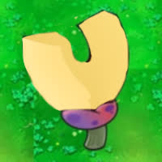
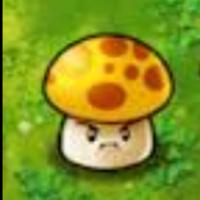
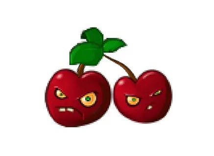
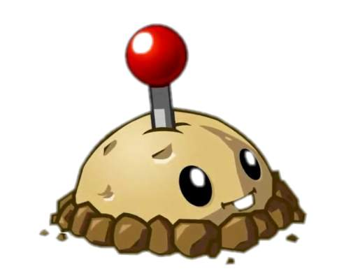

 
  Plants VS Zombies Desktop — Linux Edition
   
  
  

  ⭐Don't forget to give it a star!⭐
   
</h1>

  <b>Твой рабочий стол — поле битвы.</b>
   
  Фанатский PvZ, где зомби вторгаются на твой настоящий рабочий стол.

  
  
  

 

<i>
  Ты запускаешь игру. Появляется твой настоящий рабочий стол.
   
  Иконки начинают исчезать. Экран трескается. За трещинами — лужайка PvZ.
   
  Битва начинается.
</i>

 

---

 

<h2 align="center">🌱 Растения</h2>

<table align="center">
<tr>
<td align="center" width="120"> <b>Подсолнух</b> 50 солнц</td>
<td align="center" width="120"> <b>Горохострел</b> 75 солнц</td>
<td align="center" width="120"> <b>Папка-магнит</b> 75 солнц</td>
<td align="center" width="120"> <b>Сиамский</b> 125 солнц</td>
<td align="center" width="120"> <b>КСАС-гриб</b> 150 солнц</td>
<td align="center" width="120"> <b>Солнце-гриб</b> 25 солнц</td>
</tr>
<tr>
<td align="center">Генерирует солнца</td>
<td align="center">Стреляет горошинами</td>
<td align="center">Вытягивает файлы у зомби</td>
<td align="center">Стреляет в обе стороны</td>
<td align="center">Взрывает область 5×5</td>
<td align="center">Подсолнух для ночного режима</td>
</tr>
<tr>
<td align="center" width="120"> <b>Разархиватор</b> 50 солнц</td>
<td align="center" width="120"> <b>Касперский-боб</b> 50 солнц</td>
<td align="center" width="120"> <b>Ромашка</b> 75 солнц</td>
<td align="center" width="120"> <b>Вишня</b> 80 солнц</td>
<td align="center" width="120"> <b>Авасторех</b> 100 солнц</td>
<td align="center" width="120"> <b>Логическая мина</b> 25 солнц</td>
</tr>
<tr>
<td align="center">Разархивирует растения</td>
<td align="center">Лечит заражённые растения</td>
<td align="center">Случайный дроп</td>
<td align="center">3×3 взрыв</td>
<td align="center">Антивирус-стена</td>
<td align="center">Взрывается при контакте</td>
</tr>
</table>

 

<h2 align="center">🧟 Зомби</h2>

<table align="center">
<tr>
<td align="center" width="120"> <b>Зомби</b></td>
<td align="center" width="120"> <b>Систем</b></td>
<td align="center" width="120"> <b>HDD</b></td>
<td align="center" width="120"> <b>SSD</b></td>
<td align="center" width="120"> <b>Троян-катапульта</b></td>
<td align="center" width="120"> <b>Ваша Смерть</b></td>
</tr>
<tr>
<td align="center">Обычный</td>
<td align="center">Несёт системный файл</td>
<td align="center">Медленный, крепкий</td>
<td align="center">Быстрый, хрупкий</td>
<td align="center">Стреляет троянами</td>
<td align="center">???</td>
</tr>
</table>

 

---

 

<h2 align="center">✨ Фишки</h2>

**Твой настоящий рабочий стол** — обои, иконки, всё как есть
 
**Курсор** — управляет зомби и взаимодействует с игрой
 
**Ночной режим** — тёмная лужайка, солнце-грибы
 
**BSOD-смерти** — уникальная причина каждой смерти
 
**Панель разработчика** — консольные команды, спавн, отладка

---

 

<h2 align="center">🎮 Управление</h2>

| | |
|:---:|---|
| **ЛКМ** | Выбрать растение, посадить, собрать солнце |
| **ПКМ** | Убрать посаженное растение |
| **ESC** | Меню паузы |
| **`** | Панель разработчика |

### 🌊 Кастомные волны
Можно создавать свои волны зомби! Положи JSON-файл в папку `custom_waves/` и запусти через консоль разработчика:
- `cwave list` — список волн
- `cwave load <имя>` — запуск
- `cwave stop` — остановка

---

  Сделано <b>mark20123644-rgb</b>
   
  Фан-проект. Plants vs Zombies — торговая марка Electronic Arts.

